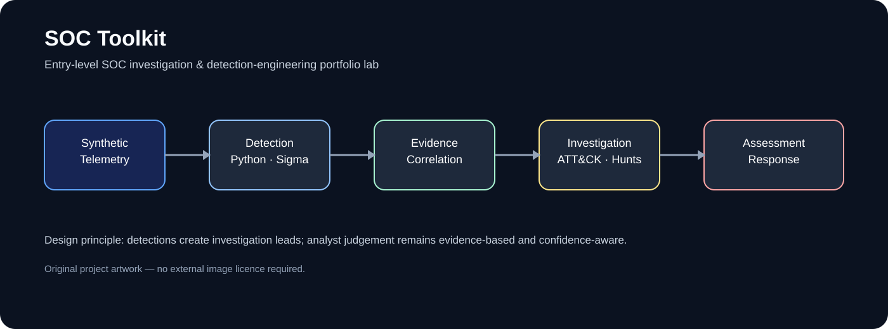
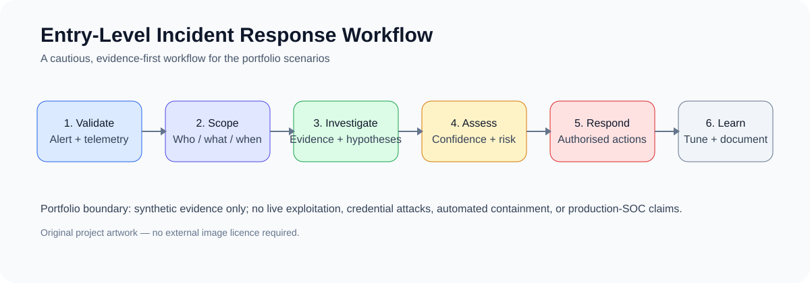

# SOC Toolkit



**Entry-level SOC investigation & detection-engineering portfolio lab**

A defensive Python project created to put cybersecurity and CySA+ learning into practice. It turns synthetic security telemetry into structured observations, detection signals, evidence correlation, analyst assessment, competing hypotheses, risk context, escalation recommendations, controlled response decisions, auditable case handling, and quality checks.

> **Project scope:** This is a personal learning and portfolio project. It has not been operated in a production SOC. Telemetry and scenarios are synthetic. The project deliberately demonstrates practical concepts without claiming production experience.

## What this demonstrates

- Security monitoring and log analysis
- Python-based defensive tooling
- Detection engineering
- MITRE ATT&CK mapping
- Sigma detection specifications
- Microsoft Sentinel KQL examples
- Splunk SPL examples
- Evidence provenance and correlation
- Competing hypotheses and confidence-aware assessment
- Basic incident-response workflows
- Threat-hunting exercises
- Regression and quality testing
- GitHub Actions and CodeQL security controls



## Analyst workflow

```text
Synthetic telemetry
       ↓
Normalisation
       ↓
Detection signal
       ↓
Evidence provenance
       ↓
Correlation
       ↓
Competing hypotheses
       ↓
Analyst assessment
       ↓
Risk / escalation
       ↓
Controlled response
       ↓
Case closure / lessons learned
```

The project deliberately separates **detection from judgement**. A rule firing is an investigation lead, not proof of brute force, compromise, malicious intent, legal breach, or attribution.

## AI-assisted development

ChatGPT was used during development, mainly to assist with coding, debugging, documentation, and reviewing ideas. The resulting code and security decisions were reviewed, adapted, and tested by the author.

## Detection engineering

The flagship authentication analytic is represented across multiple formats:

```text
Python analytic
     ↓
Sigma
     ↓
Microsoft Sentinel KQL / Splunk SPL
     ↓
MITRE ATT&CK
     ↓
Positive + negative validation
     ↓
Analyst triage
```

### Current detection catalogue

| Rule | Behaviour | ATT&CK | Formats |
|---|---|---|---|
| `AUTH-BASE-001` | Failed SSH authentication | T1110 | Python / Sigma |
| `AUTH-REPEAT-001` | Repeated failures against one account | T1110.001 | Python / Sigma |
| `AUTH-REPEAT-001` | Repeated failures across accounts | T1110.003 | Python / Sigma / KQL / SPL |
| `SOC-EXEC-001` | Suspicious PowerShell indicators | T1059.001 | Sigma / KQL / SPL |
| `SOC-ID-001` | Unusual privileged authentication context | T1078 | Sigma / KQL / SPL |
| `SOC-NET-001` | Periodic outbound traffic investigation lead | T1071 | Sigma / KQL / SPL |

These additional detections are intentionally **experimental/reference examples**. SIEM table names, fields, baselines and thresholds must be adapted and validated in a real environment.

See [`detections/README.md`](detections/README.md) and [`docs/detection-engineering.md`](docs/detection-engineering.md).

## Example investigation

[`docs/portfolio-demo.md`](docs/portfolio-demo.md) walks through `CASE-NET-001` from detection lead → evidence → hypotheses → assessment → response recommendation.

The existing scenario cases cover:

- **CASE-PHISH-001:** suspected executive impersonation / phishing
- **CASE-NET-001:** periodic outbound traffic / potential C2 and data transfer
- **CASE-INSIDER-001:** privileged-account activity requiring context
- **CASE-MULTI-001:** multi-source investigation

Each case contains machine-readable scenario data and an analyst-facing report with timeline, evidence matrix, hypotheses, assessment, risk, escalation, response, closure and lessons learned.

## Incident-response playbooks

Entry-level playbooks are provided for:

- [`Password spraying`](docs/playbooks/password-spraying.md)
- [`Compromised account`](docs/playbooks/compromised-account.md)
- [`Phishing`](docs/playbooks/phishing.md)

They are deliberately guidance-oriented rather than automated containment workflows.

## Threat-hunting exercises

- [`Password spraying hunt`](docs/threat-hunts/password-spray-hunt.md)
- [`Suspicious authentication hunt`](docs/threat-hunts/suspicious-authentication-hunt.md)

Each starts with a hypothesis and identifies the telemetry, questions and evidence needed to support or reject it.

## Evidence-first principles

- **Observed:** directly represented by supplied evidence.
- **Correlated:** a relationship between observations.
- **Inferred:** an interpretation supported by observations.
- **Hypothesis:** a possible explanation requiring validation.
- **Unknown:** not established by available evidence.

A source IP is not automatically an actor identity. A CVE reference is not proof of exploitation. CVSS severity is not the same as organisational risk. Potential impact is not observed impact. Legal/privacy fields indicate when specialist referral may be appropriate; they are not legal advice or breach determinations.

## Quality and security

The repository includes Python 3.11/3.12/3.13 CI, regression tests and CodeQL analysis. GitHub Actions uses current Node 24-compatible action versions and the security-hardening branch pins action references to immutable commit SHAs. Dependabot checks GitHub Actions and Python dependencies monthly. Synthetic case data is reproducible and auditable.

See [`SECURITY.md`](SECURITY.md), [`AUDIT.md`](AUDIT.md), [`docs/phase4-operational-maturity.md`](docs/phase4-operational-maturity.md), and [`docs/phase5-employment-readiness.md`](docs/phase5-employment-readiness.md).

## Running the toolkit

```bash
python main.py --module pipeline
python main.py --module scenarios
python main.py --module quality
python -m unittest discover -s tests -v
```

## Project structure

```text
soc_toolkit/
├── assessment.py
├── case_loader.py
├── case_management.py
├── case_metrics.py
├── correlation.py
├── escalation.py
├── evidence.py
├── hypotheses.py
├── investigation_context.py
├── models.py
├── pipeline.py
├── quality.py
├── reporting.py
├── response.py
├── risk.py
├── scenario_cases.py
└── scenario_validation.py

detections/
├── authentication.py
├── README.md
├── sigma/
└── queries/

docs/
├── assets/
├── playbooks/
├── threat-hunts/
├── portfolio-demo.md
└── detection-engineering.md

cases/
├── CASE-MULTI-001/
├── CASE-PHISH-001/
├── CASE-NET-001/
└── CASE-INSIDER-001/

tests/
└── unit and integration coverage
```

## Safety and scope

This is an educational defensive security project. It does not perform live scanning, exploitation, credential attacks, packet capture, real-world phishing or impersonation operations, persistence, target command execution, or automated containment. Results are analyst-support outputs bounded by the supplied evidence.

## Author

Created by Karen Johnston — entry-level cybersecurity portfolio focused on evidence-based detection, investigation, and defensive tooling.
